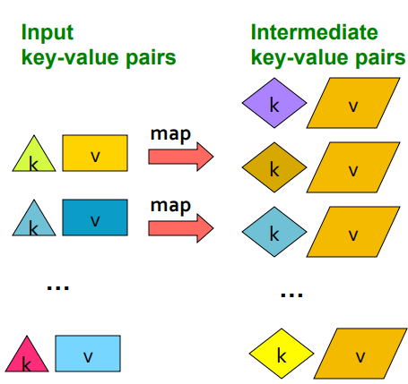
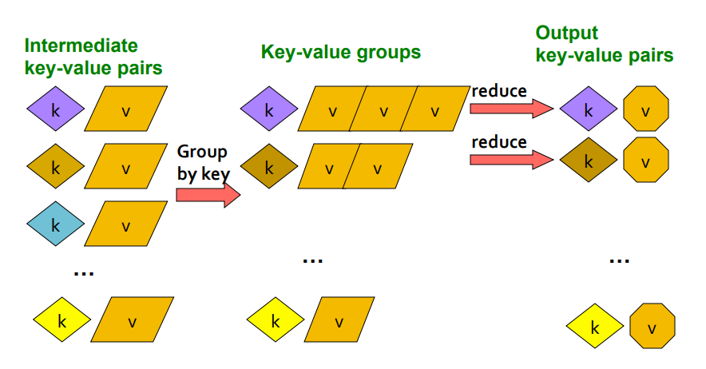
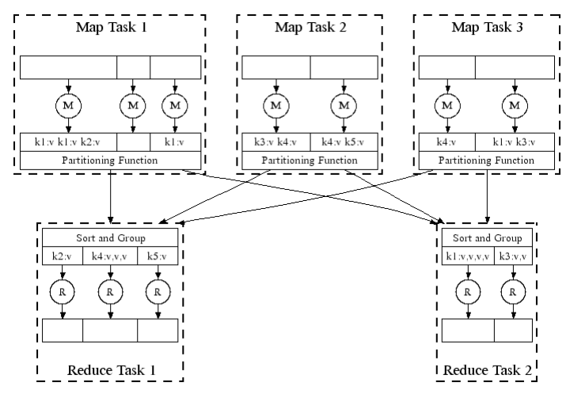
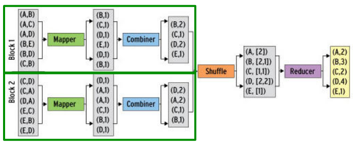

# Map Reduce

Originally implemented at Google to overcome the limitations of a classical single node architecture.


## Motivation

-   10 billion web pages
-   Average size of webpage = 20KB
-   10 billiong \* 20KB = 200TB
-   Disk read bandwidth = 50MB/sec
-   Time to read = 4 million seconds = 46+ days!
-   Even longer to do something useful with the data

## Cluster Architecture


Each rack contains 16-64 commodity nodes.

## Cluster Computing Challenges

### Node failures

-   Single server can stay up for 3 years
-   1000 servers in cluster = ~1 failure/day
-   1M servers in cluster = ~1000 failures/day

How to store data persistently and keep it available if nodes can fail? How to deal with node failures during a long-running compilation?

### Network bottleneck

-   Network bandwidth = 1Gbps
-   Moving 10TB takes approximately 1 day

### Distributed programming is hard!

-   Need a simple model that hides most of the complexity

## Map-Reduce

### Map-Reduce addresses the challenges of cluster computing

-   Store data redundantly
-   Move compuation close to data
-   Simple programming model

## Redundant Storage Infrastructure

### Distributed File System

-   Provides global file namespace, redundancy, and availability
-   Eg: Google GFS, Hadoop HDFS, Apache Spark
-   Data kept in "chunks" spread across machines
-   Each chunk replicated on different machines
-   Master node stores meta data about where files are located; can be replicated

### Typical Usage Pattern

-   Huge files (100s of GB to TB)
-   Data is rarely updated in place
-   Reads and appends are common

### Client library for file access

-   Talks to master node to find chunk servers
-   Connects directly to chunk servers to access data

## Computational Model

The following unix commands capture the essence of MapReduce and is naturally parallezable.

```
words(doc.txt) | sort | uniq -c
```

-   words: gets all words from the document (Map)
    -   Scan input file record-at-a-time
    -   Extract something you care about from each record (keys)
-   sort: orders the result (Group by key)
    -   Sort and Shuffle
-   uniq -c: provides a count of the words (Reduce)
    -   Aggregate, summarize, filter, or transform
    -   Write the result

_Outline stays the same, Map and Reduce change to fit the problemn_

### The Map Step



Input k,v pairs and outputs intermediate k,v pairs. 1 input k,v can map to 0 or multiple intermediate pairs. Stated another way: Each record in the file has a map function applied that produces intermediate k,v pairs.

### The Reduce Step



Group intermediate k,v pairs and then reduce to a single k,v (summarized, averaged, etc)

#### More Formally

-   Input a set of key-value paris
-   Provide two methods
    -   Map(k,v) -> <k', v'>
        -   There is one map called for every (k,v) pair
    -   Reduce(k', <v'>_) -> <k',v''>_
        -   All values v' with the same key k' are reduced together
        -   There is one Reduce function call per unique key k'

```js
function map(key, value) {
    // key: document name
    // value: text of the document
    for each word w in value {
        emit(w, 1);
    }
}

function reduce(key, values) {
    // key: a word
    // values: an iterator over counts
    result = 0;

    for each count v in values {
        result += v;
    }

    emit(key, result);
}

```

## Scheduling and Data Flow

### In Parallel

MapReduce can be run in a distributed system.



### Environment

The MapReduce environment takes care of:

-   Partitioning the input data
-   Scheduling the program's execution across a set of machines
-   Performing the group by key step
-   Handling node failures
-   Managing required inter-machine communication

### Data Flow

-   Input and final output are stored on the Distributed File System (DFS)
    -   Scheduler tries to schedule map tasks "close" to physical storage of input
-   Intermediate results are stored on local FS of Map and Reduce workers
-   Output is often input to another MapReduce task

### Coordination

The Master node takes care of coordination. It pings workers periodically for availability.

-   Task status: idle, in-progress, completed
-   Idle tasks: scheduled as workers become available
-   Master gets location and sizes of its R intermediate files
    -   One per reducer
-   Master pushes this info to reducers

### Dealing with Failures

-   Map Worker Failure
    -   Tasks completed or in-progress at worker are reset to idle
-   Reduce Worker Failure
    -   Only in-progress tasks are reset to idle
    -   Idle tasks restarted on other workers
-   Master Failure
    -   MapReduce task is aborted and client is notified

### Configuration

M is map tasks, R is reduce tasks

-   Rule of thumb
    -   M should be much larger than number of nodes in cluster
    -   One DFS chunk per map is common
    -   This improves load balancing and speeds up failure recovery
-   Usually R is smaller than M
    -   This is because the output is spread across R files.

## Combiners and Partition Functions

There are refinements to the basic MapReduce model that make it run faster.

### Combiners

-   Map task usually produces many pairs of the form (k1,v1), (k2, v2) for the same key
    -   eg: popular words
        -   Potentially thousands of ('The', 1) tuples that need to be shipped to reducer
-   Can save network time by pre-aggregating values in the mapper

    -   combine(k, list(v1)) -> v2
    -   Combiner is usually the same as the reduce function.

    

-   Only works is reduce function is commutative and associative
    -   Sum, Average, Median
        -   Average is not commutative and associative, can't be used
            -   Can use (Sum, count) so avg = Sum/Count
                -   Reducer sums all sums and counts and then divides
        -   Median has no way of combining

### Refinement

-   Want to control how keys get partitioned
    -   The set of keys that go to a single reduce worker
-   System uses default partition function
    -   hash(key) mod R
-   Sometimes useful to override has function
    -   eg: hash(hostname(URL)) mod R ensures URLS from a host end up in same output file

## Implementations

### Google MapReduce

-   Uses Google File System (GFS)
-   Not available outside Google

### Hadoop

-   Open-source implementation in Java
-   Uses HDFS for stable storage

### Hive, Pig

-   Provide SQL-Like abstractions on top of Hadoop MapReduce layer
