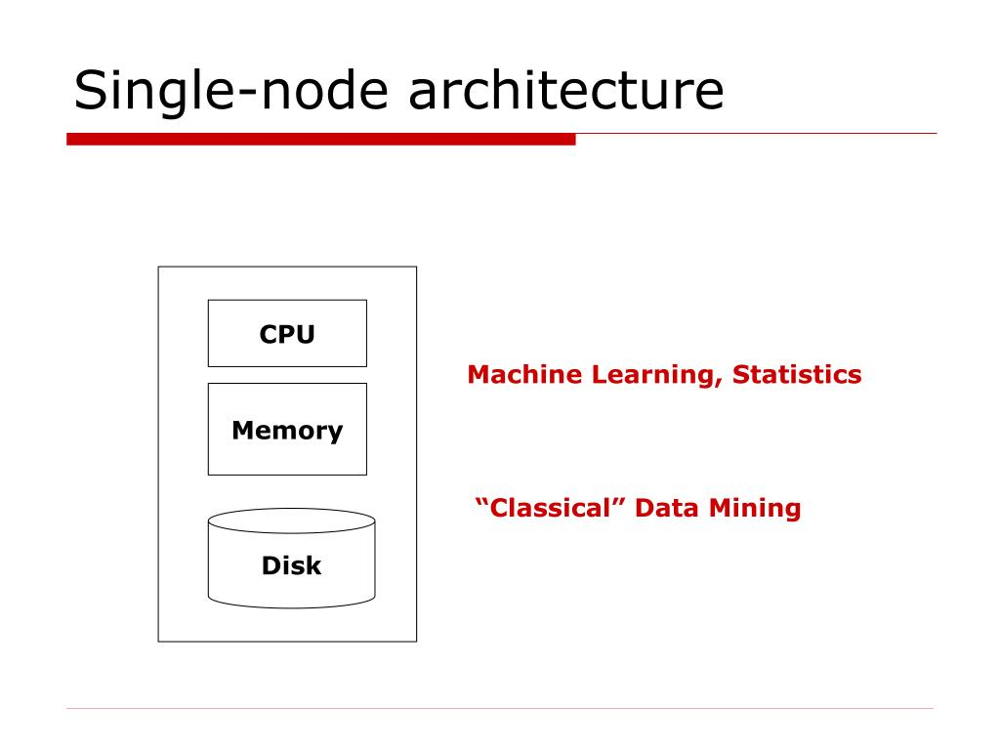
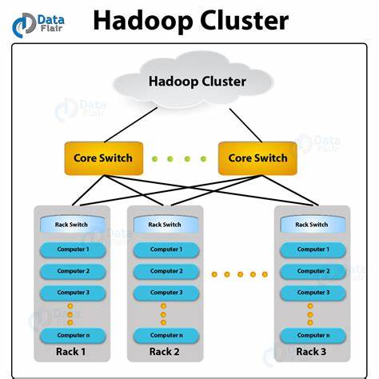

# Map Reduce

Originally implemented at Google to overcome the limitations of a classical single node architecture.

## Motivation

-   10 billion web pages
-   Average size of webpage = 20KB
-   10 billiong \* 20KB = 200TB
-   Disk read bandwidth = 50MB/sec
-   Time to read = 4 million seconds = 46+ days!
-   Even longer to do something useful with the data

## Cluster Architecture

Each rack contains 16-64 commodity nodes.

## Cluster Computing Challenges

### Node failures

-   Single server can stay up for 3 years
-   1000 servers in cluster = ~1 failure/day
-   1M servers in cluster = ~1000 failures/day

How to store data persistently and keep it available if nodes can fail? How to deal with node failures during a long-running compilation?

### Network bottleneck

-   Network bandwidth = 1Gbps
-   Moving 10TB takes approximately 1 day

### Distributed programming is hard!

-   Need a simple model that hides most of the complexity

## Map-Reduce

### Map-Reduce addresses the challenges of cluster computing

-   Store data redundantly
-   Move compuation close to data
-   Simple programming model

## Redundant Storage Infrastructure

### Distributed File System

-   Provides global file namespace, redundancy, and availability
-   Eg: Google GFS, Hadoop HDFS, Apache Spark
-   Data kept in "chunks" spread across machines
-   Each chunk replicated on different machines
-   Master node stores meta data about where files are located; can be replicated

### Typical Usage Pattern

-   Huge files (100s of GB to TB)
-   Data is rarely updated in place
-   Reads and appends are common

### Client library for file access

-   Talks to master node to find chunk servers
-   Connects directly to chunk servers to access data
