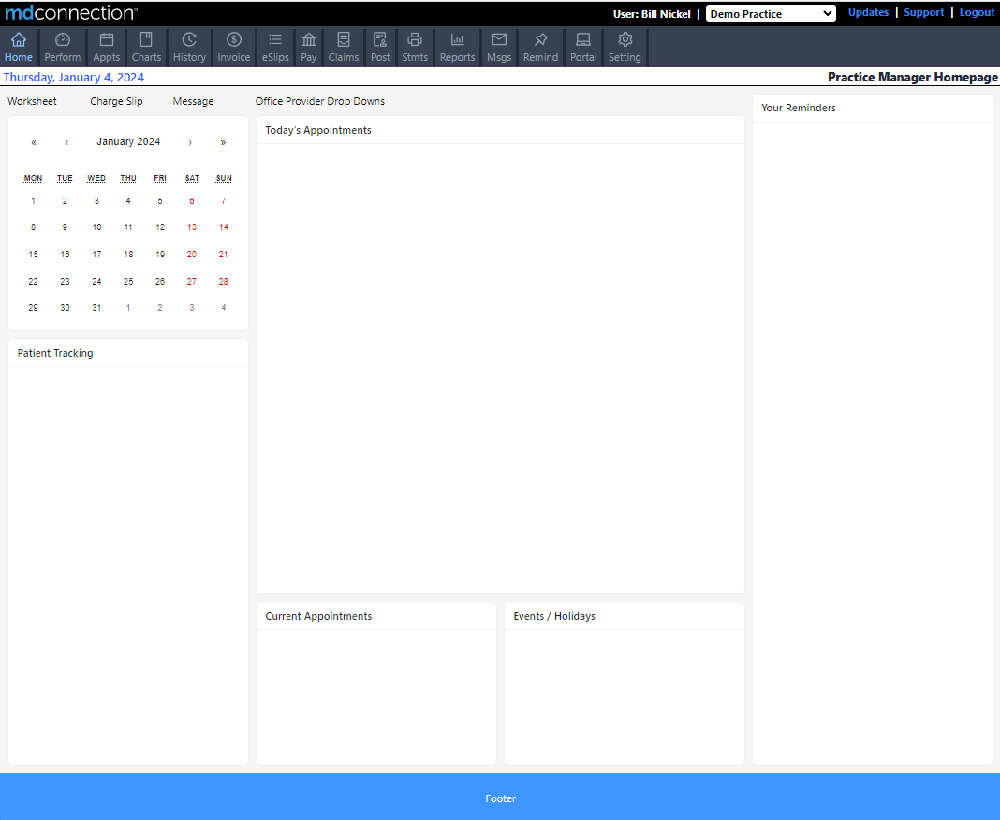

# MockMDC

This is a learning exercise in converting an existing production web application UI to React.js. It's admittedly an ambitious effort at this point but no better way to learn than to do.

The current application is an ASP.NET application that uses server side rendering with some client side fetching of data. It is fast so it will be interesting to see how well it performs in React. My main concern is the initial load time because this is a very large application with ~100 different pages.

## UI Framework Choice

There are several UI frameworks that provide default components and that seems like a good place to start.

-   [MUI](https://mui.com/)
-   [Chakra UI](https://chakra-ui.com/)
-   [Ant Design](https://ant.design/)

Ultimately, I decided to do this attempt using Ant Design because of it's popularity, license, and breadth of components. The documentation and examples are a little bit lacking (from what I can tell) but that lends itself to better "from scratch" learning.

## The UI

The following screenshot is the landing page after login.

The goal is to mimic not only this layout but also the linked to views as well while giving it a more modern look and feel. Current progress pic below. Each empty card will be implemented as components.

## API

Data for components will be mocked with simple .json files but fetched using current best practices for React (axios, react-request, other?).

## Styling

I've chosen to not go with component styling / css modules. The Atomic CSS approach of Tailwind seems like the way to go (for now) but I am, admittedly, not good with CSS.

Setting up tailwindcss with react is covered in the [docunentation](https://tailwindcss.com/docs/guides/create-react-app).

## Notes

Notes along the way will be maintained in separate markdown files.

[Ant Design Component Documentation](https://ant.design/components/overview/)

[Tailwind Cheat Sheet](https://tailwindcomponents.com/cheatsheet/)
